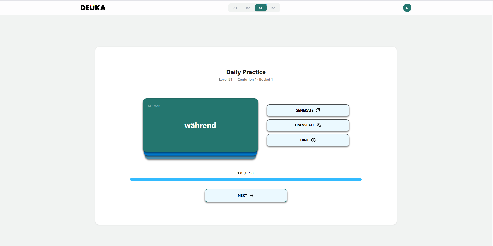
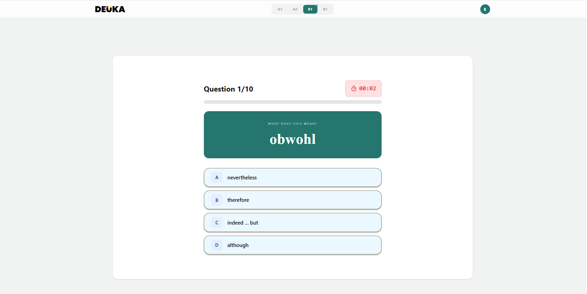
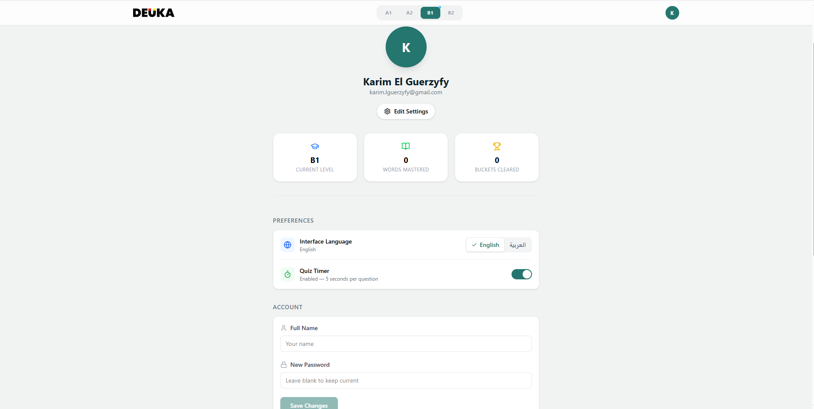
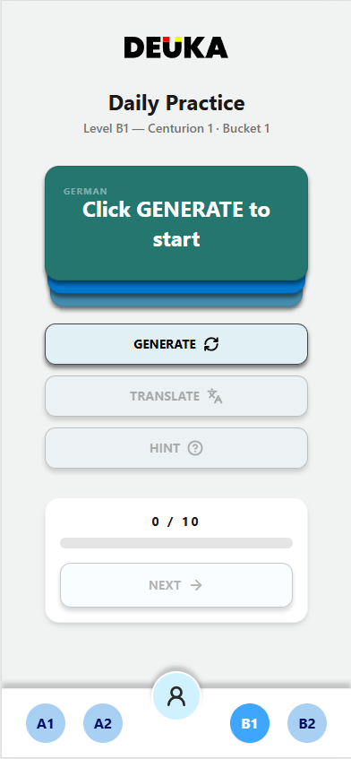

# DEUKA

> **German vocabulary mastery — built on the principle that passive exposure is not learning.**

DEUKA is a structured German vocabulary app for serious learners. It enforces genuine retention through a strict progression architecture called the **Centurion System** — a three-tier curriculum of Levels, Centurions, and Buckets that requires a perfect 10/10 quiz score to advance every 10 words. No shortcuts. No skipping. Every word is earned.

**Live:** [deuka.app](https://deuka.app) · **Repo:** [github.com/KarimElGuerzyfy/deuka-app](https://github.com/KarimElGuerzyfy/deuka-app)

---

## Table of Contents

- [Overview](#overview)
- [Screenshots](#screenshots)
- [The Centurion System](#the-centurion-system)
- [Tech Stack](#tech-stack)
- [Architecture](#architecture)
- [Data Model](#data-model)
- [Key Design Decisions](#key-design-decisions)
- [Getting Started](#getting-started)
- [Running Tests](#running-tests)
- [Build Status](#build-status)
- [A Bug That Became a Feature](#a-bug-that-became-a-feature)

---

## Overview

DEUKA covers A1 through B2 level German vocabulary — approximately 4,500 words — organized into a three-tier hierarchy. The app is designed for learners who are serious about retention, not just exposure. It is built as a portfolio project demonstrating production-quality thinking across the full stack: architecture decisions, state management, authentication, database design, PWA conversion, and UI/UX.

---

## Screenshots

| Learning Screen | Quiz Gate | Profile |
|---|---|---|
|  |  |  |

**Mobile**



---

## The Centurion System

Vocabulary in DEUKA is not a flat list. It is a curriculum.

| Unit | Composition | Size |
|---|---|---|
| **Bucket** | 10 words | Atomic unit of learning |
| **Centurion** | 10 Buckets | 100 words |
| **Level** | Multiple Centurions | A1=700 / A2=500 / B1=1000 / B2=2000 |

### The Learning Loop

Each bucket follows a fixed two-phase loop designed to separate exposure from retention.

**Phase 1 — Review**

The user works through the 10 words in the current bucket one at a time. For each word they can:
- Generate the German word
- Reveal the English or Arabic translation
- Reveal an example sentence as a contextual hint

Once all 10 words have been seen, the Next button unlocks. The user controls the pace — there is no timer in this phase.

**Phase 2 — The Quiz Gate**

Before advancing to the next bucket, the user must pass a quiz.

- All 10 words from the bucket are presented as questions
- Each question shows the German word with 4 multiple-choice answer options
- A 5-second countdown timer runs per question (can be disabled in settings)
- A **perfect score of 10/10 is required** to advance
- A single wrong answer — or a timeout — triggers an immediate fail
- On fail, the user returns to the review loop for the same bucket
- There is no limit on attempts, and no shortcut

**Progression**

```
Pass Bucket quiz  →  advance to next Bucket
Pass Bucket 10    →  advance to next Centurion, Bucket 1
Pass Centurion 7  →  Level Complete  →  advance to next Level
```

A user who completes A1 has passed 70 consecutive perfect quizzes across 7 Centurions. They genuinely know 700 German words.

### Quiz Distractor Design

The four answer options in each quiz question are not randomly selected. Distractors are chosen based on semantic and orthographic proximity to the correct answer:

- If the target word is a verb, all four options are verbs
- If the target word shares a common prefix (`ver-`, `be-`, `ent-`), distractors share that prefix
- Words from the same semantic category are prioritized

This keeps difficulty consistently medium-to-hard across all levels and prevents guessing by elimination.

### Question Shuffling

Quiz questions are reshuffled on every attempt. If a user fails and retries, the same 10 words appear but in a different order with reshuffled answer positions. This is intentional — a user who passes is one who knows the words, not one who memorized button positions.

---

## Tech Stack

| Layer | Technology | Reason |
|---|---|---|
| Framework | React + Vite | No SSR or SEO needs — Vite provides faster builds with zero overhead |
| Language | TypeScript (strict) | End-to-end type safety from vocabulary data through to the UI |
| Styling | Tailwind CSS v4 | Utility-first, consistent design token system |
| Routing | React Router DOM | `createBrowserRouter` for centralized, declarative route configuration |
| State | Zustand | Lightweight global state — no boilerplate, easy to sync with Supabase |
| Backend / Auth | Supabase | Managed auth, Postgres database, Edge Functions, and Row Level Security |
| Form Logic | React Hook Form + Zod | Schema-first validation — error states derived from the schema, not managed manually |
| PWA | vite-plugin-pwa + Workbox | Installable on Android and iOS, offline-capable, auto-updating service worker |
| Email | Resend | Custom SMTP for transactional auth emails sent from `noreply@deuka.app` |
| Domain | deuka.app (Porkbun) | Custom domain with DNS-verified email sending and Porkbun email forwarding |
| Testing | Vitest | Unit tests for core logic — vocabulary service, quiz generation, state management |

---

## Architecture

```
src/
├── components/
│   ├── PageContainer.tsx      # Shared responsive page shell
│   ├── SessionHeader.tsx      # Level / Centurion / Bucket breadcrumb
│   ├── ProgressBar.tsx        # Reusable progress indicator
│   ├── TimerPill.tsx          # Quiz countdown badge
│   ├── CardStack.tsx          # Learning card deck — Generate / Translate / Hint
│   ├── ProtectedRoute.tsx     # Auth guard
│   └── SettingsSection.tsx    # Profile settings wrapper
├── data/                      # Bundled vocabulary constants (A1–B2)
├── hooks/
│   ├── useAuth.tsx            # Supabase auth + async profile hydration
│   └── useQuizEngine.ts       # Quiz state machine — timer, answers, navigation
├── i18n/
│   └── translations.ts        # Full EN/AR translation object for all UI strings
├── layouts/
│   ├── AppLayout.tsx          # Authenticated shell with Navbar
│   └── AuthLayout.tsx         # Public shell for login / register / forgot password
├── lib/
│   └── supabase.ts            # Supabase client initialization
├── pages/
│   ├── Learning.tsx           # Primary learning screen with PWA install banner
│   ├── Quiz.tsx               # Quiz gate screen
│   ├── Profile.tsx            # User profile, stats, and settings
│   ├── Login.tsx              # Login form
│   ├── Register.tsx           # Registration form
│   ├── ForgotPassword.tsx     # Password reset request
│   └── ResetPassword.tsx      # New password entry (token from email)
├── router/
│   └── index.tsx              # Centralized route configuration
├── services/
│   ├── vocabularyService.ts   # getBucket, generateWord, getDistractors
│   └── profileService.ts      # loadProfile, saveProfile — Supabase sync
├── store/
│   └── useGameStore.ts        # Zustand store — all app state and actions
├── tests/
│   └── vocabularyService.test.ts  # 18 unit tests — vocabulary, quiz, state
└── types/                     # Shared TypeScript type definitions
public/
└── icons/
    ├── icon-192.png           # PWA icon (Android)
    ├── icon-512.png           # PWA icon (splash screen)
    └── icon-180.png           # Apple touch icon (iOS)
supabase/
└── functions/
    ├── delete-account/        # Deletes auth user via service role key
    ├── block-demo-password-change/  # Blocks password changes on demo account
    └── _shared/
        └── cors.ts
vercel.json                    # SPA rewrite rule
vite.config.ts                 # Vite + PWA manifest + Workbox config
```

---

## Data Model

Every word in DEUKA follows a strict shape enforced by TypeScript:

```typescript
type Word = {
  id: string        // Format: "A1-1-1-4" — encodes level, centurion, bucket, position
  de: string        // German word
  en: string        // English translation
  ar: string        // Arabic translation
  sentence: string  // Example sentence in German
  category: Category
}
```

The ID format is not an arbitrary identifier — it is a set of coordinates. `A1-1-1-4` encodes Level A1, Centurion 1, Bucket 1, Position 4. This makes progress tracking, filtering, and debugging trivial without additional database lookups.

---

## Key Design Decisions

### Vite over Next.js

DEUKA is a fully client-side application. There are no public pages requiring search indexing, no server-rendered content, and no SEO requirements. Using Next.js would add infrastructure complexity with zero benefit. Vite was chosen deliberately and justified — Next.js is reserved for the portfolio site where SSR and SEO are genuinely appropriate.

### Bundled vocabulary data over database records

Word lists are TypeScript constants bundled with the application rather than fetched from a database at runtime. The vocabulary is static, curated content — it never changes based on user input. Bundling it eliminates unnecessary network requests, keeps the data layer simple, and allows the app to function offline.

### ID format as curriculum coordinates

The word ID `A1-1-1-4` encodes its exact position in the three-tier hierarchy. This design decision pays dividends everywhere: progress filtering, debugging, quiz construction, and bucket boundary detection all become trivial operations on string coordinates rather than opaque numeric joins.

### Zustand for global state

Learning progress, curriculum position, quiz state, and user preferences are all managed through a single Zustand store. Zustand was chosen for its minimal API, zero boilerplate, and clean compatibility with Supabase persistence. The store is the single source of truth — Supabase is the persistence layer, not a second source.

### Supabase persistence strategy — write on advancement only

Profile data is written to Supabase only when the user advances a bucket — not on every state change. This minimizes database writes while ensuring that the one event that actually matters (earned progression) is always persisted. Preferences (language, timer toggle) are written immediately on change. On login, the profile is fetched once and used to hydrate the Zustand store before the UI renders, eliminating any flash of default state.

### Auth architecture — single listener, async hydration

Session management uses a single `onAuthStateChange` listener as the source of truth. A competing `getSession()` call was deliberately removed to eliminate the `NavigatorLockAcquireTimeoutError` caused by concurrent auth requests. Profile hydration is awaited before `loading` is set to `false`, ensuring the UI never renders with stale default values.

### Direct fetch over Supabase client for profile reads and writes

After encountering persistent deadlocks when using the Supabase JS client inside the auth listener context, profile read and write operations were switched to direct `fetch` calls with explicit auth headers. This bypasses the client's internal locking mechanism while retaining full RLS enforcement at the database level.

### Supabase Edge Functions for sensitive operations

Two Edge Functions handle operations that require elevated privileges:

**`delete-account`** — Deleting a user requires the Supabase service role key, which cannot be exposed to the client. The function uses the user's JWT to delete the profile row (RLS-enforced), then uses the service role key to delete the auth user.

**`block-demo-password-change`** — The demo account (`demo@deuka.app`) is protected from password changes by checking the authenticated user's ID server-side before allowing a password update to proceed. The demo account UID is hardcoded in the function — no client-side logic can bypass it.

### PWA over native app

DEUKA is distributed as a Progressive Web App rather than a native iOS/Android application. This decision was deliberate: no app store fees, no separate codebase, installable directly from the browser on both platforms. The same codebase that runs in the browser installs as a standalone app. If store presence becomes valuable after user acquisition, the existing PWA can be wrapped with Capacitor with minimal changes.

### PWA deep linking via `launch_handler`

Auth confirmation links sent by email redirect to `https://deuka.app/auth/...`. On Android, the `launch_handler: { client_mode: 'navigate-existing' }` manifest property instructs the OS to route these links directly into the installed PWA window rather than opening a browser tab. Users who have installed DEUKA complete their auth flow inside the app, not a detached browser session.

### Workbox NetworkOnly for Supabase

The service worker is configured with a `NetworkOnly` rule for all Supabase URLs. Auth tokens, profile data, and quiz state must always come from the network — serving stale auth responses from cache would produce silent session failures. All other assets (JS, CSS, icons) are cached normally for offline support.

### Custom email infrastructure

Auth emails (signup confirmation, password reset) are sent from `noreply@deuka.app` via Resend's SMTP relay. The sending subdomain `deuka.app` is DNS-verified in Resend with DKIM, SPF, and DMARC records. This eliminates Supabase's default rate-limited email service and gives DEUKA a professional sender identity. Supabase email templates are fully customized with DEUKA branding.

### Full Arabic UI with RTL support

DEUKA is fully bilingual — English and Arabic — with complete UI translation and RTL layout switching. The Arabic UI is not a separate layout; it is the same component tree with direction and language toggled reactively. `document.documentElement.dir` and `document.documentElement.lang` are set by a Zustand subscriber that fires immediately on mount and on every language toggle, ensuring the correct direction is applied before the first render with no flash of LTR content. Cairo font is loaded for Arabic; Figtree handles Latin script. All 4,500 words include Arabic translations, making DEUKA fully usable as an Arabic-native learning app.

---

## Getting Started

### Prerequisites

- Node.js (Latest LTS)
- A Supabase project with Email auth enabled
- Supabase CLI (for Edge Function deployment)

### Installation

```bash
# Clone the repository
git clone https://github.com/KarimElGuerzyfy/deuka-app.git
cd deuka-app

# Install dependencies
npm install

# Create environment file
cp .env.example .env
```

Add your Supabase credentials to `.env`:

```
VITE_SUPABASE_URL=your_project_url
VITE_SUPABASE_ANON_KEY=your_anon_key
```

```bash
# Start the development server
npm run dev
```

### Try the Demo

A read-only demo account is available to explore the app without registering:

```
Email:    demo@deuka.app
Password: Demo1234
```

The demo account cannot change its password (enforced server-side via Edge Function).

### Database Setup

Run the following SQL in your Supabase SQL editor:

```sql
-- Profiles table
create table public.profiles (
  id uuid references auth.users on delete cascade primary key,
  current_level text default 'A1',
  current_centurion_index integer default 0,
  current_bucket_index integer default 0,
  words_mastered integer default 0,
  buckets_cleared integer default 0,
  display_language text default 'en',
  timer_enabled boolean default true,
  updated_at timestamp with time zone default now()
);

-- Row Level Security
alter table public.profiles enable row level security;

create policy "Users can read own profile" on public.profiles
  for select using (auth.uid() = id);

create policy "Users can update own profile" on public.profiles
  for update using (auth.uid() = id);

create policy "Users can insert own profile" on public.profiles
  for insert with check (auth.uid() = id);

-- Schema access
grant usage on schema public to authenticated;
grant all on public.profiles to authenticated;

-- Auto-create profile on registration
create or replace function handle_new_user()
returns trigger as $$
begin
  insert into public.profiles (id) values (new.id)
  on conflict do nothing;
  return new;
end;
$$ language plpgsql security definer;

create trigger on_auth_user_created
  after insert on auth.users
  for each row execute procedure handle_new_user();
```

### Edge Function Deployment

```bash
npx supabase functions deploy delete-account
npx supabase functions deploy block-demo-password-change
```

---

## Running Tests

```bash
npx vitest run src/tests/vocabularyService.test.ts
```

18 unit tests covering:

- `vocabularyService.getBucket` — valid bucket retrieval, word shape, ID coordinate format, A2 index offsets, invalid coordinate handling
- `getDistractors` — 4 unique options per question, correct answer always present, no duplicates
- Language toggle state — initial language, `en` ↔ `ar` switching, RTL derivation

All 18 tests pass against the production codebase.

---

## Build Status

| Phase | Description | Status |
|---|---|---|
| 1 | Foundation — routing, auth, layouts | ✅ Complete |
| 2 | Data layer — type system, A1 vocabulary | ✅ Complete |
| 3 | Learning Screen — Generate / Translate / Hint loop | ✅ Complete |
| 4 | Auth & Profile — session management, name/password update | ✅ Complete |
| 5 | Internationalization — EN/AR language toggle | ✅ Complete |
| 6 | Quiz Gate — timer, distractors, fail/pass flow | ✅ Complete |
| 7 | Supabase — progress persistence, profile sync, account deletion | ✅ Complete |
| 8 | Polish — responsive design, screenshots, deploy to Vercel | ✅ Complete |
| 9 | Vocabulary data — full A1–B2 word lists (EN + AR) | ✅ Complete |
| 10 | Arabic UI — full RTL layout, Cairo font, reactive direction switching | ✅ Complete |
| 11 | PWA — installable, offline-capable, auto-updating, install banner | ✅ Complete |
| 12 | Custom domain — deuka.app, SSL, Vercel DNS | ✅ Complete |
| 13 | Email infrastructure — Resend SMTP, custom templates, noreply@deuka.app | ✅ Complete |
| 14 | Auth flows — forgot password, reset password pages | ✅ Complete |
| 15 | Demo account — protected from password changes via Edge Function | ✅ Complete |
| 16 | Unit tests — 18 passing tests via Vitest | ✅ Complete |

---

## A Bug That Became a Feature

Late in production, a behaviour was discovered: switching levels in the A1/A2/B1/B2 navigation bar reset the user's bucket position to zero. The instinct was to fix it.

Then it became clear that fixing it would require significant additional logic — tracking progress separately per level, preventing position bleed between levels, deciding what "current level" means when the user has partial progress across multiple levels. The complexity was real and the benefit was questionable.

More importantly, the behaviour fit the philosophy of DEUKA perfectly.

The Centurion System is built on the principle that mastery is earned, not navigated. A user who switches from A1 to B2 mid-session hasn't mastered A1. They haven't earned B2. Allowing them to hold their A1 position while exploring B2 would undermine the entire architecture of the app — it would turn a progression system into a word browser.

The decision was made to keep the reset behaviour and make it explicit. Switching levels now triggers a confirmation modal that requires the user to type the target level name before proceeding. The warning is unambiguous: all progress on the current level will be erased. Words mastered, buckets cleared, curriculum position — all reset to zero.

This transforms what was a bug into a deliberate UX constraint that reinforces the app's core value: **you earn your level, you don't choose it**.

The implementation is three lines of store logic and a modal. The alternative — multi-level progress tracking — would have been weeks of work for a feature that actively works against what DEUKA is trying to be.

Recognising when a technical behaviour aligns with product intent, and choosing to embrace it rather than patch it, is one of the more valuable skills in software development. This was one of those moments.

---

## Known Constraints & Gotchas

- **React Compiler is enabled** — do not use manual `useCallback` or `useMemo` except where `Math.random()` is involved.
- **No `localStorage` / Zustand `persist`** — Supabase is the single source of truth.
- **`profileService` uses direct `fetch`** — not the Supabase JS client. Do not switch back.
- **Single `onAuthStateChange` listener** — do not add a competing `getSession()` call.
- **Word ID prefix matching** — never reconstruct ID prefixes from store indices. Always compare against actual word IDs from `vocabularyService.getBucket()`.
- **Vercel SPA routing** — `vercel.json` rewrite rule is required. Without it, direct navigation to any route returns 404.
- **Escaped apostrophes in data files** — `\'` inside single-quoted strings passes `tsc` but breaks the browser ES module parser. Use double quotes for any string containing an apostrophe.
- **PWA only testable on production** — manifest and service worker require HTTPS + real domain.
- **`beforeinstallprompt` Android only** — iOS has no programmatic install prompt.
- **Translations `as const` removed** — required for TypeScript to accept EN/AR as the same type shape.

---

*DEUKA — Established 2026*
